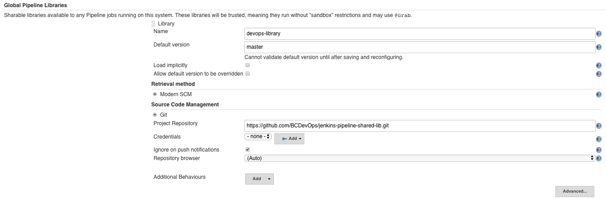

# jenkins-pipeline-shared-lib
Extending Jenkins with a Shared Library

https://jenkins.io/doc/book/pipeline/shared-libraries/


## Project Setup

### Jenkins

You must add the shared library into the configuration for Jenkins.  
This can be found in **Manage Jenkins->Configure System->Global Pipeline Libraries**:

From there you will want to setup up the library to use git and point it at this repository:



> #### NOTE: THE IMAGE ABOVE CURRENTLY POINTS TO MY FORK OF THIS REPO, WHICH SHOULD CHANGE UPON PR

### Jenkinsfile

Once you have your shared library setup, you can now use the utilities within your `Jenkinsfile` like so:

```groovy
@Library('devops-library') _

def hasRepoChanged = false;
node{
  def lastCommit = getLastCommit()  // <------------------- getLastCommit utility from vars/
  
  if(lastCommit != null){
    if(env.CHANGE_AUTHOR_DISPLAY_NAME == null){
      env.CHANGE_AUTHOR_DISPLAY_NAME = lastCommit.author.fullName
    }

    if(env.CHANGE_TITLE == null){
      env.CHANGE_TITLE = lastCommit.msg
    }
    hasRepoChanged = true;
  }else{
    hasRepoChanged = false;
  }
}

if(hasRepoChanged){
  stage('Build ' + APP_NAME) {
    node{
      try{
        echo "Building: " + ARTIFACT_BUILD
        openshiftBuild bldCfg: ARTIFACT_BUILD, showBuildLogs: 'true'
        
        echo "Assembling Runtime: " + RUNTIME_BUILD
        openshiftBuild bldCfg: RUNTIME_BUILD, showBuildLogs: 'true'
      }catch(error){
        slackNotify(            // <------------------- slackNotify utility from vars/
          'Build Broken 🤕',
          "The latest ${APP_NAME} build seems to have broken\n'${error.message}'",
          'danger',
          env.SLACK_HOOK,
          SLACK_DEV_CHANNEL,
          [
            [
              type: "button",
              text: "View Build Logs",
              style:"danger",           
              url: "${currentBuild.absoluteUrl}/console"
            ]
          ])
        throw error
      }
    }
  }
}
```

## Utilities Available

The utility functions that are available to be called like global helpers can be found in the [vars/](./vars/) folder.  We currently have:

- [getChangeString](./vars/getChangeString.groovy)
    - Generates a string representation of a changeset
- [getLastCommit](./vars/getLastCommit.groovy)
    - Get's the last commit from the changeset, returns null if the build is a repeat
- [hasDirectoryChanged](./vars/hasDirectoryChanged.groovy)
    - Will return `true` or `false` whether or not a particular directory has been modified in the current changeset.  Useful if multiple builds are triggered from a single repo
- [slackNotify](./vars/slackNotify.groovy)
    - Sends a notification to slack via [Incoming Webhook](https://api.slack.com/incoming-webhooks)
    - >Note: The webhook URL should be placed into an environment variable and not in your repositories code base as it should be kept secret


## Directory Structure:

```
(root)
+- src                     # Groovy source files
|   +- org
|       +- foo
|           +- Bar.groovy  # for org.foo.Bar class
+- vars
|   +- foo.groovy          # for global 'foo' variable / custom step
|   +- foo.txt             # help for 'foo' variable
```

The src directory looks like a standard Java source directory structure. This directory is added to the classpath when executing Pipelines.

The vars directory hosts scripts that define global variables accessible from Pipeline. The basename of each *.groovy file should be a Groovy (~ Java) identifier, conventionally camelCased. The matching *.txt, if present, can contain documentation, processed through the system’s configured markup formatter (so may really be HTML, Markdown, etc., though the txt extension is required).

The Groovy source files in these directories get the same “CPS transformation” as in Scripted Pipeline.


Pipeline Steps 
https://jenkins.io/doc/pipeline/steps/
